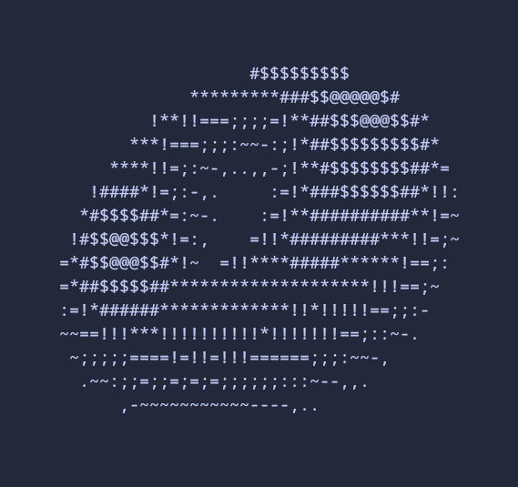

<p align="center">
  
</p>

## Donut.py

There are two versions of this. A sane, normal one, and one that I compressed down to a single line of code. I was largely inspired by the following sources:
- [This](https://www.youtube.com/watch?v=Xz2f-PtQAdk&t=98s) video about compressing Python to a single line
- [This](https://www.a1k0n.net/2011/07/20/donut-math.html) well known blog deriving the equations for a rotating torus

There are a few tricks I'd like to add to Python one liners that the first video did not mention.

## The Walrus Operator

The walrus operator `:=` allows you to define a variable inline and returns it. This is helpful in plenty of circumstances. I use both features in the codebase, namely I was able to do the following transformation:
```Python
A = 0
B = 0
for i in range(..):
	...
```
```Python
[A := 0, B := 0, [[ ... ] for i in range(..)]]
```
Typically, I'd either have to pass the extra arguments through a lambda or use global state, the usage of both of which could have been heavily reduced if I had known of this prior to starting. I think this is a much cleaner solution than both of them (and should be faster than a dictionary lookup).

I was also able to use this to create a really clean `for` loop pattern, consider the following code:
```Python

L = cosphi*costheta*sinB - cosA*costheta*sinphi - sinA*sintheta + cosB*(cosA*sintheta - costheta*sinA*sinphi)

if L > 0 and 1/z > zbuffer[yp][xp]:
	zbuffer[yp][xp] = 1/z
	luminance_index = math.floor(L*8)
	output[yp][xp] = ".,-~:;=!*#$@"[luminance_index]
```
Creating a one liner here would require both checking `L` and using `L` in the loop's body. However, since the walrus operator also returns the value assigned, we don't even have to use the previous pattern (which can avoid unnecessary nesting). This gives us the following:
```Python
((L := cp*ct*sb - ca*ct*sp - sa*st + cb*(ca*st - ct*sa*sp)) > 0 and 1/z > globals()["zb"][yp][xp]) and [globals()["zb"][yp].__setitem__(xp, 1/z), globals()["o"][yp].__setitem__(xp, ".,-~:;=!*#$@"[floor(L*8)])]
```

This may be a bit intimidating to read, but if we take it in parts, it's not so bad.
`((L := ...) > 0 and 1/z > ... )` becomes the `if` statement (we can see the return of the walrus operator being in use here). We replace the original `if` statement with just the `and` keyword, as lambdas expect an expression. This works because of short circuiting, a compiler optimization that ignores the right side of the branch if the left side is false, effectively becoming an `if` statement. Everything after the second `and` and inside the brackets is what used to be the body of the if statement, which includes the usage of `L` once more. 
In short, walrus operator saved my life and I owe it money now.

## dict.\_\_setitem\_\_()
I had this really unfortunate problem where I had to set the value of a global 2d array, but I both could not use the `=` operator (as that is a complete statement and expects a newline afterwards) nor the `.update()` function (as lists can not be keys). I thought is was done for, but I stumbled across the `.__setitem__()` method on dictionaries. This is just what Python calls under the hood when you do a subscript assignment, but it saved me completely. This makes both
```Python
zbuffer[yp][xp] = 1/z
output[yp][xp] = ".,-~:;=!*#$@"[luminance_index]
```
trivial transformations.
